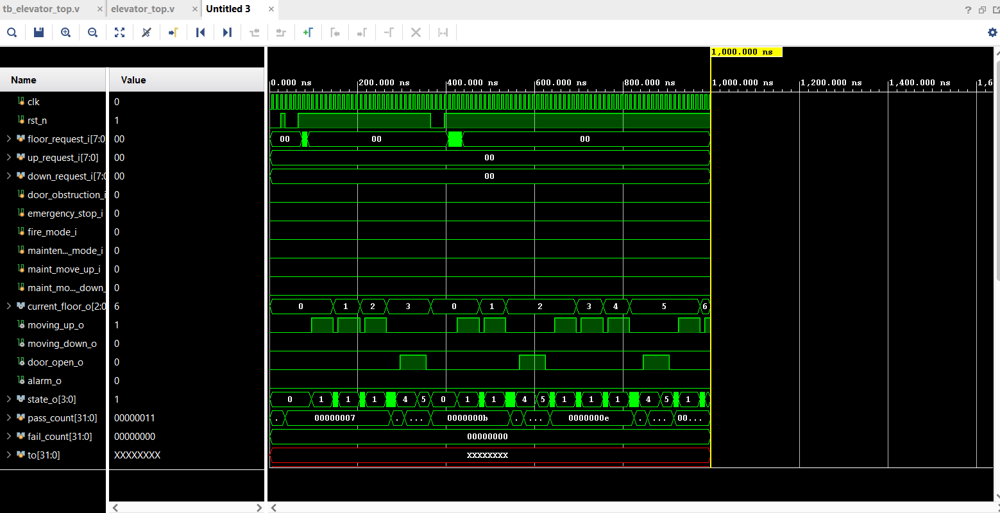
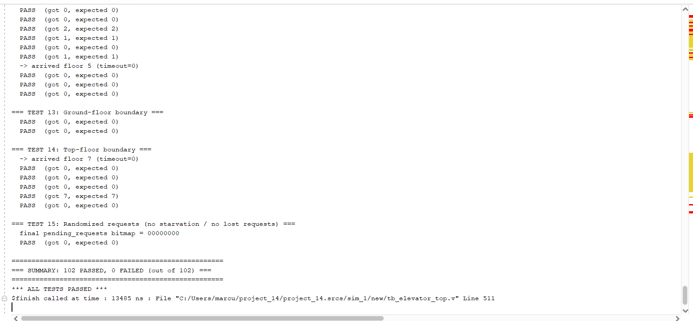
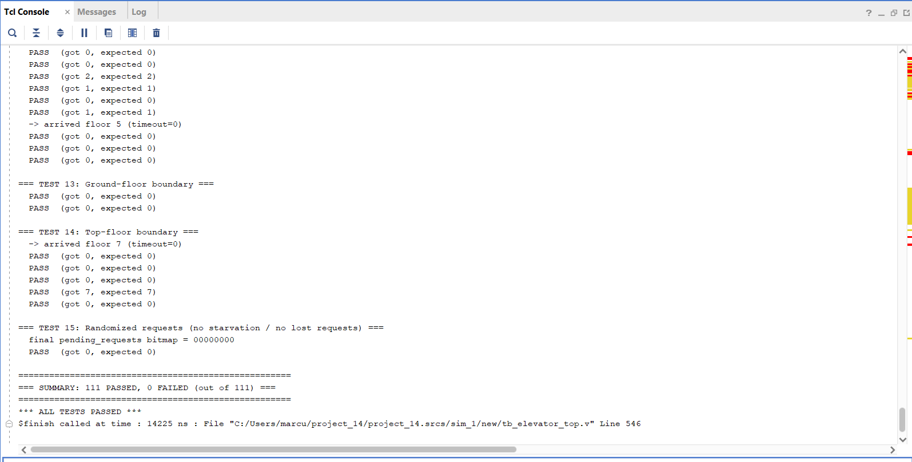

# Smart Elevator Controller (Verilog)

A synthesizable Verilog-2001 controller for a multi-floor elevator: a SCAN/LOOK-style
request scheduler, door dwell/obstruction handling, and safety-mode arbitration
(emergency stop, fire recall, maintenance jog), all integrated under one top-level
FSM. Includes a self-checking testbench.

## Architecture

```
elevator_top
├── request_manager     - latches cabin + hall-call buttons into a pending-requests bitmap
├── scheduler            - SCAN/LOOK combinational logic: decides next travel direction
├── door_controller       - door dwell timer + obstruction interlock
├── safety_controller    - priority arbitration: EMERGENCY > FIRE_MODE > MAINTENANCE
└── elevator_fsm          - main FSM: floor counter, direction, door requests, overrides
```

| Parameter          | Default | Description                                   |
|---------------------|---------|------------------------------------------------|
| `NUM_FLOORS`        | 8       | Number of floors served (0 .. NUM_FLOORS-1)    |
| `FLOOR_BITS`        | 3       | Width of the floor index bus (must fit NUM_FLOORS) |
| `MOVE_TICKS`        | 10      | Clock cycles to travel between adjacent floors |
| `DOOR_OPEN_CYCLES`  | 10      | Door dwell time once open and unobstructed     |

### FSM states
`S_IDLE`, `S_MOVE_UP`, `S_MOVE_DOWN`, `S_DOOR_OPEN`, `S_DOOR_WAIT`, `S_DOOR_CLOSE`,
`S_EMERGENCY`, `S_FIRE_MODE`, `S_MAINTENANCE`.

## Features

- **SCAN/LOOK scheduling** — keeps moving in the current direction while requests
  remain ahead, only reversing once the way ahead is clear (avoids the classic
  "changes mind every floor" problem).
- **Door safety interlock** — obstruction sensor holds/restarts the dwell timer;
  the FSM can never start moving with the door physically still open.
- **Safety mode priority** — `EMERGENCY > FIRE_MODE > MAINTENANCE`, centralized in
  `safety_controller`, documented and enforced everywhere the door/motion logic
  could otherwise leave a state ambiguous (e.g. door forced shut before/while the
  car moves during a fire recall, even if triggered mid-dwell).
- **Manual maintenance jog** — up/down single-step motion with normal requests
  suppressed but preserved for later service.

## Testbench

`tb/tb_elevator_top.v` is self-checking (own `check()` task, PASS/FAIL per
assertion, final summary) and covers: reset behavior, single/multiple/duplicate
requests, SCAN ordering above/below/both directions, requests injected mid-move,
door dwell timing, door obstruction, emergency stop, fire-mode recall (including a
regression test for fire mode triggered mid-dwell with the door open away from the
ground floor), maintenance jog, floor boundary conditions, and a randomized
no-starvation/no-lost-request soak test.

Latest run:

```
=== SUMMARY: 111 PASSED, 0 FAILED (out of 111) ===
*** ALL TESTS PASSED ***
```

## Screenshots

**Waveform** (Vivado, functional simulation) — floor counter, moving_up/down,
door_open, and FSM state cycling through requests:



**Full regression run — 111/111 passing** (Vivado waveform view, full run from
reset to `$finish` at 14.225 us; `pass_count` ends at `0x6f` = 111, `fail_count`
stays `0`):



**Test summary — 111/111 passing** (Vivado Tcl console, after the fire-mode fix
and the new `TEST 11b` regression test):



## Running the simulation

With [Icarus Verilog](http://iverilog.icarus.com/):

```bash
iverilog -o sim.vvp tb/tb_elevator_top.v rtl/*.v
vvp sim.vvp
```

This also dumps `elevator_waves.vcd` (viewable with GTKWave) via `$dumpvars` in
the testbench.

Also verified in Vivado's behavioral simulator (Icarus and Vivado results match).

## Repository layout

```
rtl/   - synthesizable design sources
tb/    - self-checking testbench
```

## License

MIT (see `LICENSE`).
